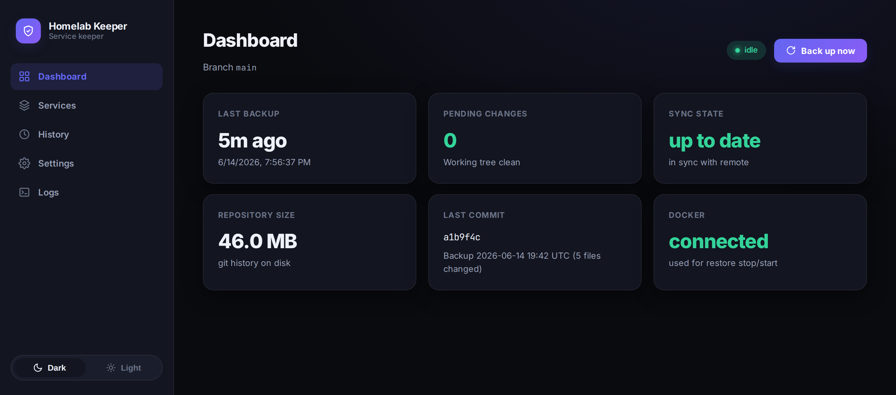
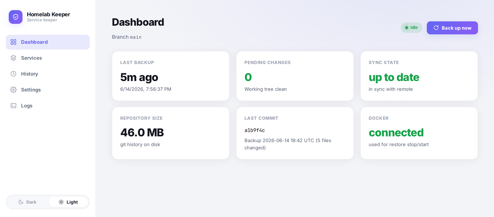

<p align="center">
  
</p>

<p align="center">
  
</p>

<h1 align="center">Homelab Service Backup</h1>

<p align="center">
  Version-control your homelab service directories into a <strong>private</strong> GitHub
  repository &mdash; and restore them in one click.
</p>

<p align="center">
  
  
  
  
</p>

<p align="center">
  <a href="#features">Features</a> &nbsp;&middot;&nbsp;
  <a href="#how-it-works">How it works</a> &nbsp;&middot;&nbsp;
  <a href="#quick-setup">Quick setup</a> &nbsp;&middot;&nbsp;
  <a href="#restoring-after-a-total-failure">Disaster recovery</a> &nbsp;&middot;&nbsp;
  <a href="#development">Development</a>
</p>

---

A self-hosted Docker service that version-controls your homelab service
directories (Jellyfin, the *arr stack, Deluge, etc.) into a **private** GitHub
repository, so you can recover from a critical failure. It exposes a web UI for
monitoring, configuration, and one-click restore.

It uses **git itself** as the storage and versioning engine: your services
directory is the git work-tree, the `.git` directory lives in the container's
data volume, and every backup is a commit that gets pushed to GitHub. That gives
you version history, diffs, "last synced" status, and trivial restore for free —
with **no data duplication**.

## Screenshots

The dashboard ships with a modern UI and built-in light and dark themes.

<table>
  <tr>
    <td align="center"><strong>Dark</strong></td>
    <td align="center"><strong>Light</strong></td>
  </tr>
  <tr>
    <td></td>
    <td></td>
  </tr>
</table>

## Features

- **Single container** — FastAPI backend + React frontend in one Docker image.
- **Hybrid sync** — filesystem watching with a debounce, plus a periodic safety
  interval (configurable; can also be watch-only or interval-only).
- **Granular exclusions** — per-service and per-directory, e.g. skip the
  multi-GB `audiobookshelf/data` folder while still backing up its `config`.
- **One-click restore** — from any backup, with a diff preview and optional
  automatic stop/start of the affected containers via the Docker socket.
- **Web dashboard** — sync status, last synced, pending changes, ahead/behind
  remote, repo size, manual "Back up now" / "Push now".
- **Disaster-recovery manifest** — auto-generated `BACKUP_MANIFEST.md/json`
  listing services, images and ports.
- **Notifications** — optional ntfy / Discord / Gotify webhook.
- **Observability** — healthcheck (`/healthz`) and Prometheus metrics
  (`/metrics`).

## How it works

```text
host:/opt  ──(mounted RW)──>  container:/services       (git work-tree)
                              container:/data/repo.git   (git dir + history)
                              container:/data/state.db   (settings/state)
```

A backup is just git, end to end:

| Operation | What runs |
| --------- | --------- |
| **Backup** | `git add -A` → `git commit` → `git push` (HTTPS + PAT) |
| **Exclude** | written to `repo.git/info/exclude`, so your real folders stay clean |
| **Restore** | `git checkout <commit> -- <path>` |

## Quick setup

1. Download [`docker-compose.yaml`](docker-compose.yaml):

   ```bash
   curl -O https://raw.githubusercontent.com/kostadin-tonchekliev/homelab-keeper/main/docker-compose.yaml
   ```

2. Adjust the settings to your environment:
   - Map your services base directory to `/services` (default `/opt:/services`).
   - Update the published port (default `8787`) and `TZ` if needed.

3. Start the container:

   ```bash
   docker compose up -d
   ```

4. Open `http://<server-ip>:8787` and go to **Settings**:
   - Set the **GitHub repository URL** (must be a **private** repo).
   - Paste a **fine-grained Personal Access Token** with `Contents: read & write`
     on that repo.
   - Choose your sync mode/interval, then click **Connect & initialise**.

5. Go to **Services** and toggle off any large data directories you don't want
   backed up.

6. Hit **Back up now** on the Dashboard for the first commit.

> [!WARNING]
> The repo will contain real secrets (auth files, keys, sqlite DBs) backed up
> as-is, so it **must stay private**.

## Building your own image

Clone the repo and build the image locally:

```bash
git clone https://github.com/kostadin-tonchekliev/homelab-keeper.git
cd homelab-keeper
docker compose up -d --build
```

To rebuild after making source changes without restarting:

```bash
docker compose build
```

To rebuild and restart in one step (`/data` volume is preserved):

```bash
docker compose up -d --build
```

The build compiles the React frontend (Node stage) and copies the Python backend
into the image. The running container's `/data` volume — which holds your git
history and settings — is never touched by a rebuild.

## Restoring after a total failure

Even with the mini PC gone, the GitHub repo is a full snapshot:

```bash
git clone https://github.com/you/homelab-backup.git /opt
cd /opt/<service> && docker compose up -d   # repeat per service
```

> [!TIP]
> `BACKUP_MANIFEST.md` (committed on every backup) lists each service's images
> and ports to guide recovery.

## Development

**Backend**

```bash
cd backend
pip install -r requirements.txt
DATA_DIR=./data SERVICES_DIR=../example-services uvicorn app.main:app --reload
```

**Frontend** (proxies `/api` to `localhost:8000`)

```bash
cd frontend
npm install
npm run dev
```

### Updating the screenshots

The README images in [`docs/`](docs/) are generated from the real UI with a
headless browser, using mocked API data (no backend required). Regenerate them
after any UI change with a single command:

```bash
cd frontend
npm run screenshot
```

This builds the frontend, boots a temporary preview server, and captures the
dark and light dashboards to `docs/`. One-time setup for the headless browser:

```bash
npx playwright install chromium          # downloads Chromium
# Linux only — install the OS libraries Chromium needs:
sudo npx playwright install-deps chromium
```

To change what the screenshots depict (or add pages), edit the `MOCK_DATA` and
`SHOTS` definitions in [`frontend/scripts/screenshot.mjs`](frontend/scripts/screenshot.mjs).

## Notes

> [!NOTE]
> The file watcher uses inotify. If you watch very many directories you may need
> to raise the host limit:
>
> ```bash
> echo 'fs.inotify.max_user_watches=524288' | sudo tee /etc/sysctl.d/99-inotify.conf
> sudo sysctl -p /etc/sysctl.d/99-inotify.conf
> ```
>
> Excluded directories are not watched, which keeps the count low.

- The container needs the Docker socket only for the restore stop/start feature;
  remove that mount to disable it.
